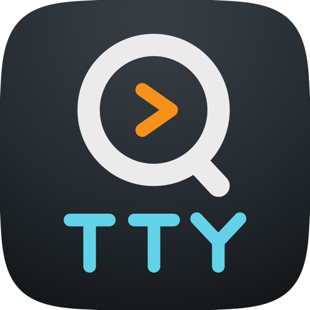
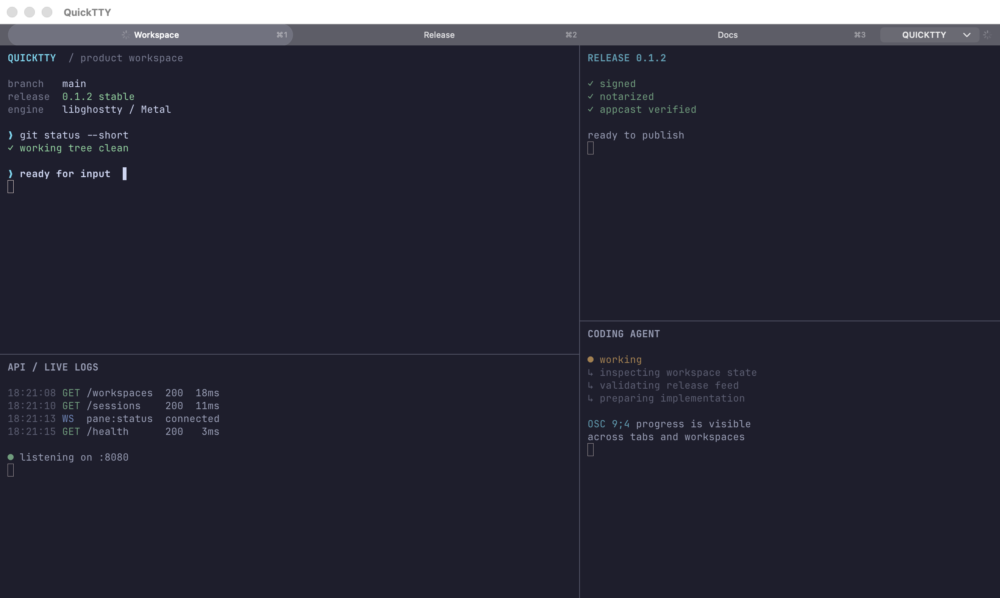

<div align="center">
  <a href="https://quicktty.app">
    
  </a>

# QuickTTY

**A native terminal workspace for macOS.**

Keep shells, coding agents, logs, and long-running tasks organized in one window with tabs, splits, named workspaces, and Quake mode.

[Website](https://quicktty.app) · [Download](https://github.com/dntsk/quicktty/releases/latest) · [Documentation](https://quicktty.app/docs/) · [Releases](https://github.com/dntsk/quicktty/releases)

[](https://github.com/dntsk/quicktty/releases/latest)
[](LICENSE)


</div>



## One window for every active task

QuickTTY is a native AppKit terminal powered by the full [`libghostty`](https://github.com/ghostty-org/ghostty) engine. It is designed for developers who need several live shells without turning terminal management into another project.

- **Tabs and binary splits** — arrange interactive shells, logs, tests, and agents side by side.
- **Named workspaces** — switch projects while background processes keep running.
- **Normal and Quake modes** — move the same live workspace between a standard window and a drop-down presentation without restarting shells.
- **Broadcast input** — send keyboard input or a confirmed paste to every pane in the active tab.
- **Native search** — search the active terminal with match navigation and result counts.
- **Coding-agent continuity** — show standard OSC `9;4` progress and optionally relaunch a version-verified native agent session into its original pane after restart. This restores an opaque agent session ID, not a PTY or process checkpoint. Auto-resume supports installed Pi versions that report a valid semantic version and expose the required public lifecycle extension API; it is locally verified on current Pi `0.84.4`.
- **Ghostty configuration and themes** — use the terminal engine's rendering, shell integration, fonts, palettes, and themes.

## Install

QuickTTY requires **macOS 15 or newer** on an **Apple Silicon Mac**.

1. [Download the latest stable DMG](https://github.com/dntsk/quicktty/releases/latest).
2. Open the DMG and move QuickTTY to Applications.
3. Launch QuickTTY. Stable builds are signed with Developer ID and notarized by Apple.

QuickTTY can check for stable updates in the app. An opt-in beta channel is also available; see the [release channels](https://quicktty.app/releases/) page for details.

## Documentation

The [QuickTTY documentation](https://quicktty.app/docs/) covers installation, configuration, keyboard shortcuts, Quake mode, broadcast input, search, workspaces, and coding-agent integrations. Agent integrations are installed only through an explicit preview and confirmation flow; QuickTTY does not silently write third-party configuration or persist arbitrary restore commands.

QuickTTY reads its user configuration from:

```text
~/.config/quicktty/config
```

Open it from **QuickTTY → Open Configuration…**. Valid changes reload without recreating terminal sessions. QuickTTY owns application shortcuts; supported local bindings use repeated `quicktty-shortcut` entries rather than Ghostty `keybind` entries.

## Build from source

### Requirements

- macOS 15 or newer on Apple Silicon
- Full Xcode installation
- [XcodeGen](https://github.com/yonaskolb/XcodeGen) 2.45.4 or newer
- Apple Swift Format, available as `swift format`
- Zig exactly 0.15.2 for the pinned Ghostty revision

Clone the repository with its submodules, verify the toolchain, and build:

```sh
git clone --recurse-submodules https://github.com/dntsk/quicktty.git
cd quicktty
make doctor
make build
```

If the repository was cloned without submodules:

```sh
git submodule update --init --recursive
```

Common development commands:

```sh
make generate  # Generate the Xcode project
make format    # Format Swift sources
make lint      # Run static and contract checks
make build     # Build the Debug app
make test      # Run the test suite
make check     # Run the complete local verification
```

Generated Xcode projects, Ghostty XCFrameworks, and DerivedData are not committed.

## Contributing

Contributions are welcome. Read [CONTRIBUTING.md](CONTRIBUTING.md) before opening a pull request. Larger feature proposals should start with an issue so they can be checked against QuickTTY's intentionally focused product scope.

- [Report a bug](https://github.com/dntsk/quicktty/issues/new?template=bug_report.yml)
- [Request a feature](https://github.com/dntsk/quicktty/issues/new?template=feature_request.yml)
- [Security policy](SECURITY.md)
- [Code of Conduct](CODE_OF_CONDUCT.md)

Release signing, notarization, and appcast maintenance follow the repository's [release runbook](docs/releasing.md). Third-party attribution is recorded in [THIRD_PARTY_NOTICES.md](THIRD_PARTY_NOTICES.md).

### Release maintainer note

The beta channel is a superset of stable. After every newer stable or beta application release, promote the exact final appcast to [`docs/appcasts/beta.xml`](docs/appcasts/beta.xml) with `make beta-feed` in a separate post-release commit. Follow the release runbook rather than editing the feed manually.

## License

QuickTTY is available under the [MIT License](LICENSE).
